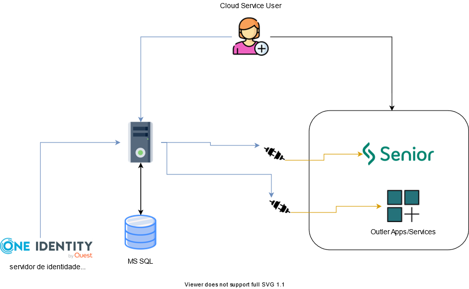
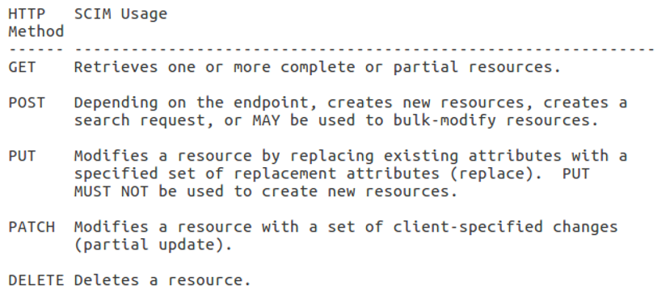
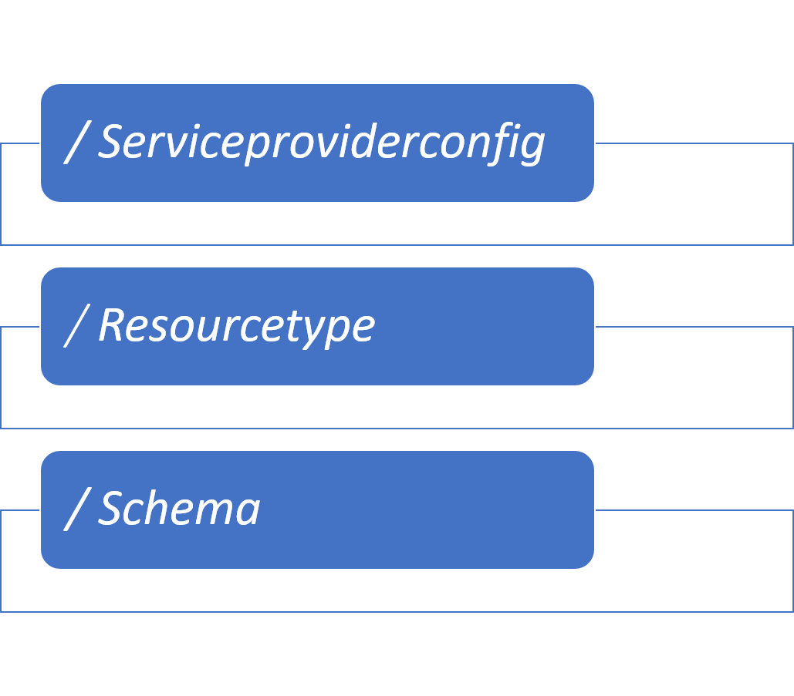

# System-for-Cross-domain-Identity-Management


## O que é SCIM

A especificação do System for Cross-domain Identity Management (SCIM) foi criada para simplificar a gestão das identidades dos usuários em aplicativos e serviços em nuvem, oferecendo um padrão para a troca de informações entre diferentes sistemas. Essa padronização ajuda a garantir a interoperabilidade, segurança e escalabilidade necessárias para lidar com identidades de usuários que precisam ser gerenciadas em várias plataformas e serviços. O SCIM é uma solução especialmente útil para empresas que trabalham com múltiplos sistemas e aplicativos, proporcionando uma maneira eficiente de gerenciar e manter as identidades dos usuários em diferentes contextos de nuvem.


## Problemática
Digamos que a empresa ABC use alguns aplicativos em nuvem como Gmail, Salesforce e alguns outros aplicativos em nuvem. Um novo funcionário, Bob, entra para a empresa. Durante o processo de integração de Bob, o gerente de RH deseja criar um novo perfil de usuário para Bob no diretório de identidade central e conceder acesso a outros serviços. Não é eficiente para os administradores inserirem informações do usuário em todos esses ambientes. Nesse ponto, a estrutura de provisionamento entra em cena. A estrutura de provisionamento resolverá o fardo dos administradores. Ele provisionará automaticamente os novos usuários para esses aplicativos e serviços em nuvem.

## Como o SCIM abstrai esse problema
Cada um dos serviços terá sua própria maneira de se comunicar com a estrutura de provisionamento, resultando em vários conectores. Este é um esforço de integração redundante para ECS e CSP. Manter e oferecer suporte a esses conectores individuais se tornará um pesadelo para os administradores e incorrerá em um custo extra. O SCIM para provisionamento de identidade foi projetado para mitigar tais cenários para que todos concordem em um protocolo aberto ou uma forma comum de comunicação.


## Padrão

### HTTP method
O conceito subjacente do SCIM 2.0 é baseado em um esquema de usuário comum, esquema de grupo e um modelo de extensão que são trocados por meio de um protocolo baseado em HTTP


### Modelo de dados
Ele tem um modelo de objeto onde um Recurso é o denominador comum e todos os outros objetos SCIM são derivados dele. Um recurso deve ter um id, externalId e meta como atributos. User, Group e EnterpriseUser estendem os atributos comuns. O SCIM não é exclusivo para esses recursos e pode ser estendido para oferecer suporte a outros tipos de recursos.


### Terminais SCIM
Para simplificar a interoperabilidade, o SCIM fornece três pontos finais para descobrir recursos compatíveis e detalhes de atributos específicos:


## Exemplo de resposta
Um “Recurso” é um objeto JSON contendo um atributo “esquema” que indica uma lista de um ou mais URIs incluídos nos esquemas SCIM. O suporte de esquema do SCIM é baseado em atributos, onde cada atributo pode ter um tipo diferente, mutabilidade, cardinalidade ou capacidade de retorno. 

```json
{
  "schemas": ["urn:ietf:params:scim:schemas:core:2.0:User"],
  "id":"2819c223-7f76-453a-919d-413861904646",
  "externalId":"dschrute",
  "meta":{
    "resourceType": "User",
    "created":"2011-08-01T18:29:49.793Z",
    "lastModified":"2011-08-01T18:29:49.793Z",
    "location":"https://example.com/v2/Users/2819c223...",
    "version":"W\/\"f250dd84f0671c3\""
  },
  "name":{
    "formatted": "Mr. Dwight K Schrute, III",
    "familyName": "Schrute",
    "givenName": "Dwight",
    "middleName": "Kurt",
    "honorificPrefix": "Mr.",
    "honorificSuffix": "III"
  },
  "userName":"dschrute",
  "phoneNumbers":[
    {
      "value":"555-555-8377",
      "type":"work"
    }
  ],
  "emails":[
    {
      "value":"dschrute@example.com",
      "type":"work",
      "primary": true
    }
  ]
}


```

## Cenários normalmente usados

- Migração das identidades
- Serviço SSO
- Provisionamento de contas de usuário para uma comunidade de interesse
- Transferência de atributos para o site de uma parte confiável
- Notificação de mudança

## Conclusão
Embora existam padrões para descrever e trocar informações do usuário, muitos desses padrões podem ser difíceis de implementar e usar. As especificações SCIM são projetadas para tornar o gerenciamento de identidade em aplicativos e serviços baseados em nuvem mais fácil, barato e rápido.
E usar para provisionar, atualizar e desprovisionar usuários e grupos removerá essa carga de trabalho dos administradores atuais.
## License
[MIT](https://choosealicense.com/licenses/mit/)
